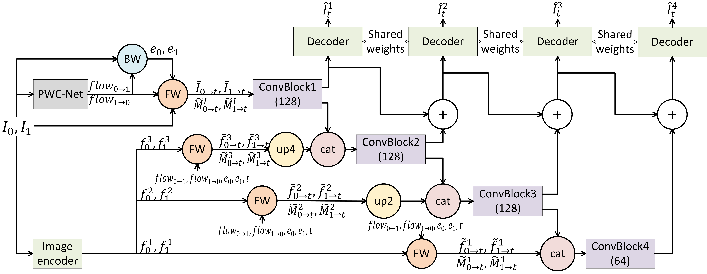
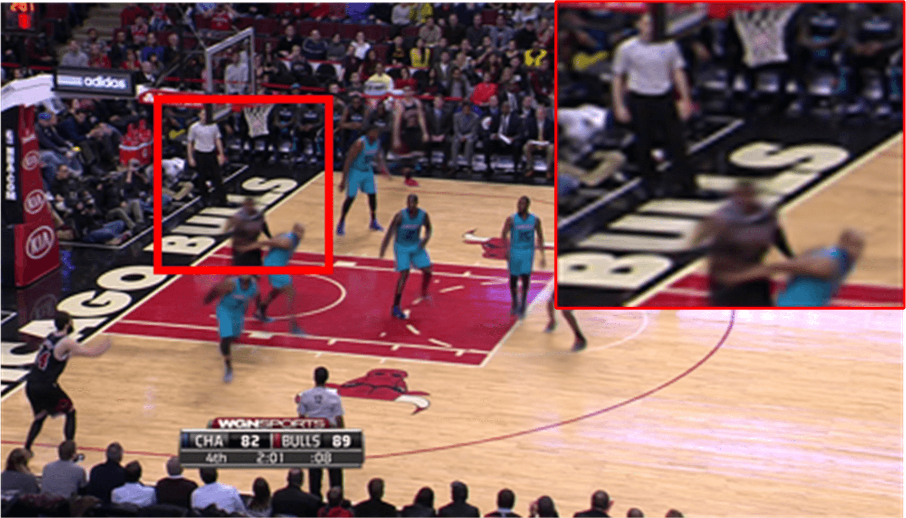
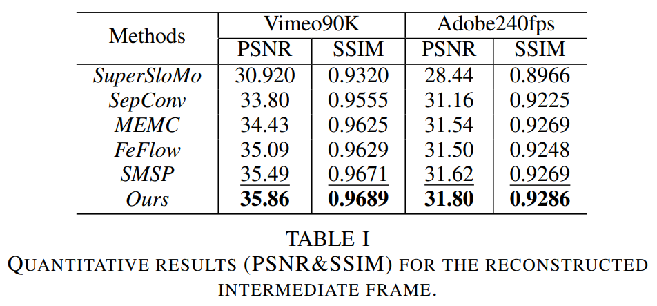

# VISAPP2022
## Deep Video Frame Rate Up-conversion Network using Feature-based Progressive Residue Refinement
This repository contains more result details of our paper submitted to VISAPP 2022: [Deep Video Frame Rate Up-conversion Network using Feature-based Progressive Residue Refinement]

## Introduction
In this paper, we propose a deep learning-based network for video frame rate up-conversion (or video frame interpolation). The proposed optical flow-based pipeline employs deep features extracted from encoder to learn residue maps for progressively refining synthesized intermediate frame. We also propose a procedure for finetuning the optical flow estimation module using frame interpolation datasets, which does not require ground truth optical flows. This procedure is effective to obtain interpolation task-oriented optical flows and can be applied to other frameworks utilizing a deep optical flow estimation module. Experimental results demonstrate that our proposed network performs favorably against state-of-the-art methods both in terms of qualitative and quantitative measures.

## Algorithm overview

## Progressive residual refinement
The progressive residual refinement effects are visualized as follows:
<table border="0" cellpadding="0" cellspacing="0">
  <tbody>
    <tr>
    <td style="width: 380px; text-align: center;"> </td>
	  <td style="width: 380px; text-align: center;"> </td>
	  <td style="width: 380px; text-align: center;"> </td>
	  <td style="width: 380px; text-align: center;"> </td>

</small></td>
    </tr>
    <tr>
	  <td style="text-align: center;"><small>PSNR 26.42dB, SSIM 0.9014</small></td> 
  	  <td style="text-align: center;"><small>PSNR 26.64dB, SSIM 0.9070</small></td>
  	  <td style="text-align: center;"><small>PSNR 27.83dB, SSIM 0.9317</small></td> 
  	  <td style="text-align: center;"><small>PSNR 28.42dB, SSIM 0.9422</small></td> 
  	</tr>
  </tbody>
</table>

## Quantitative assessment

  

## Additional results on Berkeley's dataset (up-convert video frame rate to 8X)
Videos taken from Wang, T. C., Zhu, J. Y., Kalantari, N. K., Efros, A. A., & Ramamoorthi, R. (2017). Light field video capture using a learning-based hybrid imaging system. ACM Transactions on Graphics (TOG), 36(4), 1-13. We take the central views of all key frames.

seq02

seq03

seq04

## References
**SuperSloMo**: H. Jiang, D. Sun, V. Jampani, J. Kautz, et al. "Super slomo: High quality estimation of multiple intermediate frames for video interpolation". In IEEE. Int. Conf. on Computer Vision and Pattern Recognition (CVPR), 2018.
**SepConv**: S. Niklaus, L. Mai, and F. Liu. "Video frame interpolation via adaptive separable convolution". In IEEE Int. Conf. on Computer Vision (ICCV), 2017.
**MEMC**: W. Bao, W. Lai, X. Zhang, M. Yang, et al. "Memc-net: Motion estimation and motion compensation driven neural network for video interpolation and enhancement". IEEE Trans. Pattern Anal. Mach. Intell. (TPAMI),2019.
**FeFlow**: S. Gui, C. Wang, Q. Chen, and D. Tao. "Featureflow: Robust video interpolation via structure-to-texture generation". In IEEE. Int. Conf. on Computer Vision and Pattern Recognition (CVPR), 2020
**SMSP**: S. Niklaus and F. Liu. "Softmax splatting for video frame interpolation". In IEEE. Int. Conf. on Computer Vision and Pattern Recognition (CVPR), 2020.
